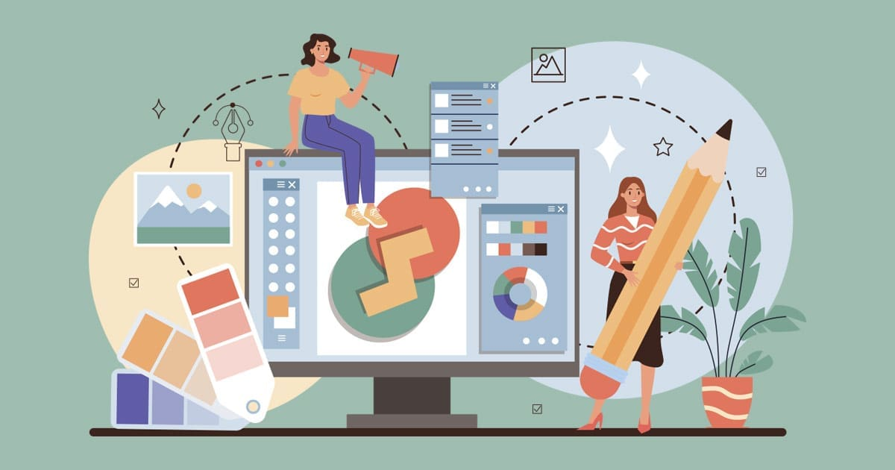

# The Portfolio of An Ngoc Nhu Do_Graphic-UX/UI-Motion Designer ᝰ✍🏻 .ᐟ

Welcome to my personal portfolio repo,  
This portfolio shows my skills, projects and work that reflects my passion as a Designer 
Here, you'll find most projects that higlight my abilities in graphic design, responive design, interactive animations and artworks.

---

## 📜 Table of Contents
- [About](#-about-)
- [Skills](#-skills-)
- [Features](#-features-)
- [Installation](#-installation-)
- [Contact](#-contact-)

---

## 👩‍🎨 About Me
This portfolio is a reflection of my journey as a designer—where creativity meets strategy.
Each project showcases my evolving mastery of design principles, tools, and visual storytelling techniques.
From branding to digital interfaces, I approach every challenge with a problem-solving mindset and a passion for crafting impactful, user-centered solutions. I hope these works offer a glimpse into how I translate ideas into compelling visuals that resonate and inspire.

---

## 🎭 Skills

### Languages 
- HTML5  
- CSS3  
- JavaScript  
- PHP  
- SQL  

### Frameworks & Libraries
- GSAP (GreenSock Animation Platform)  
- SASS/SCSS  

### Tools
- Git / GitHub  
- VS Code  
- Adobe Family Software
- Clip Studio Paint 

### Technologies
- MySQL Database  
- Responsive Design   
- Form Validation  

---

## 📋 Features
- ⚡️ Fully Responsive  
- ⚡️ Valid HTML5 & CSS3  
- ⚡️ GSAP Smooth Animations  
- ⚡️ Dynamic Content with PHP & MySQL  
- ⚡️ Interactive Contact Form  
- ⚡️ Mobile-First Design  

---
## Installation
- To run the portfolio locally:

- Clone this repository
Navigate into the project directory:

- Open the index.html file in your browser, or if using a local server, start the server and navigate to localhost to view.
---
## Contact
Feel free to reach out if you’d like to collaborate or have any questions!

LinkedIn: An Ngoc Nhu Do

Thank you for visiting my portfolio!